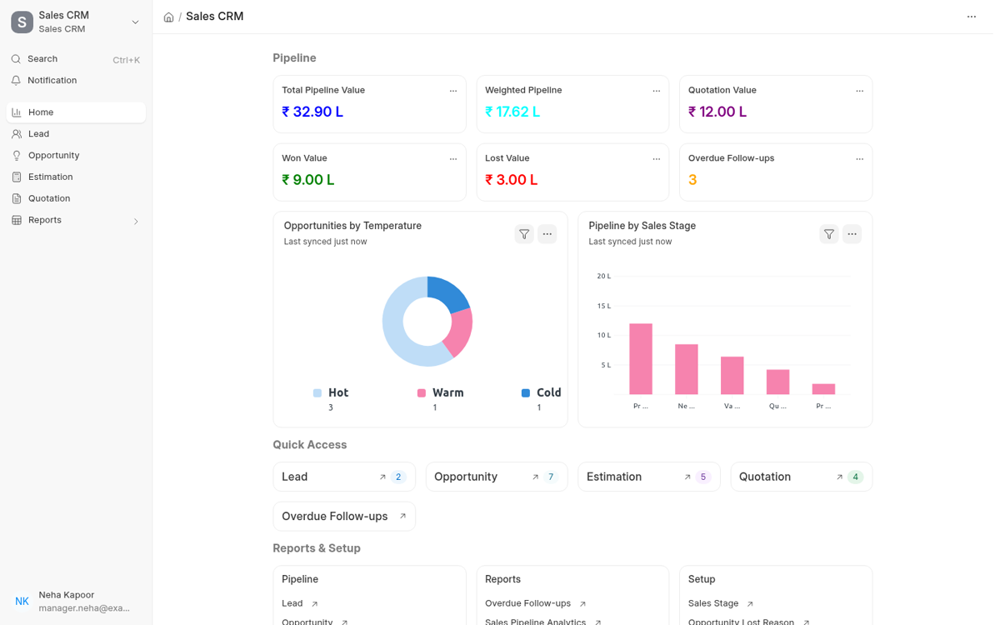

## Sales CRM for ERPNext

A small Frappe app that turns ERPNext's CRM into an end-to-end sales pipeline:

**Lead → Opportunity → Estimation → Quotation → Follow-up → Won / Lost**

It reuses standard ERPNext documents wherever they already do the job and adds only what is missing: an **Estimation** doctype with cost build-up and approval, CRM follow-up fields, a pipeline dashboard, overdue follow-up automation and owner-based record access.



Built and tested on **Frappe 16.18 / ERPNext 16.17** (Python 3.14).

### Contents

- [Installation](#installation)
- [How the pipeline works](#how-the-pipeline-works)
- [Architecture](#architecture)
- [Standard ERPNext doctypes used](#standard-erpnext-doctypes-used)
- [Custom doctypes created](#custom-doctypes-created)
- [Design decisions](#design-decisions)
- [Tests](#tests)
- [Time taken](#time-taken)

---

### Installation

Prerequisites: a bench with ERPNext v16 installed and a site on which the ERPNext setup wizard has been completed.

```bash
cd frappe-bench
bench get-app https://github.com/ritikaaaaguptaa/sales_crm.git --branch main
bench --site <your-site> install-app sales_crm
bench --site <your-site> migrate
```

Installing creates the custom fields, the Estimation approval workflow, the workspace, number cards, charts and the report. Nothing else needs configuring.

**Optional demo data** (never on production): two Sales Users, a Sales Manager and a pipeline covering every stage.

```bash
bench --site <your-site> execute sales_crm.demo.create_demo_data
```

| User | Role | Password |
| --- | --- | --- |
| `rep.asha@example.com` | Sales User | `Demo@1234` |
| `rep.vikram@example.com` | Sales User | `Demo@1234` |
| `manager.neha@example.com` | Sales Manager (+ Sales User) | `Demo@1234` |

Open **Sales CRM** from the desktop.

---

### How the pipeline works

| Stage | What happens | Standard or custom |
| --- | --- | --- |
| **Lead** | Captured as a normal ERPNext Lead; a new *Temperature* (Hot / Warm / Cold) field is added. | Standard + 1 field |
| **Opportunity** | Created with ERPNext's own *Create → Opportunity* button. Temperature and owner carry over through the standard mapper because the field names match. | Standard + CRM fields |
| **Estimation** | *Create → Estimation* on the Opportunity. Per item/scope: material, labour and outsourcing cost → total cost → markup % → selling price → margin %. | **Custom doctype** |
| **Approval** | Frappe Workflow *Estimation Approval*: Draft → Pending Approval → Approved / Rejected. Only a Sales Manager can approve (approve = submit). | Standard Workflow, shipped as a fixture |
| **Quotation** | *Create Quotation* on an approved Estimation creates a draft ERPNext Quotation with items, quantities and selling rates, linked back to the Estimation and the Opportunity. | Standard Quotation + link field |
| **Follow-up** | *Log Follow-up* on the Opportunity saves a standard CRM Note and moves the Next Follow-up Date. Last Activity Date updates itself from notes, emails, comments and quotations. | Standard CRM Note |
| **Won** | Quotation → *Create → Sales Order* (standard). ERPNext marks the Quotation *Ordered* and the Opportunity *Converted*; for a Lead it also creates the Customer. | Standard |
| **Lost** | *Declare Lost* on the Quotation or Opportunity (standard, with Lost Reasons). The app copies a quotation's lost reason onto the Opportunity. | Standard + small sync |

#### CRM fields on Opportunity

| Required field | Implementation |
| --- | --- |
| Hot / Warm / Cold | `temperature`: **new** Select field (also on Lead) |
| Next Follow-up Date | `next_follow_up_date`: **new** Date field |
| Last Activity Date | `last_activity_date`: **new**, read-only, maintained automatically |
| Expected Closing Date | `expected_closing`: **standard**, reused |
| Probability % | `probability`: **standard**, reused |
| Expected Value | `opportunity_amount`: **standard**, relabelled "Expected Value" |
| Lost Reason | `lost_reasons` + `order_lost_reason`: **standard**, filled by *Declare Lost* |
| *(extra)* Weighted Value | `weighted_value`: **new**, Expected Value × Probability, stored so standard number cards can sum it |

#### Dashboard (workspace *Sales CRM*)

All widgets are standard **Number Cards** and **Dashboard Charts** shipped as JSON in the module. There is no custom dashboard code. Because they query through `frappe.get_list`, a Sales User automatically sees only their own pipeline.

| Widget | Definition |
| --- | --- |
| Total Pipeline Value | Σ Expected Value of open opportunities (Open, Replied, Quotation) |
| Weighted Pipeline | Σ Weighted Value of open opportunities |
| Quotation Value | Σ net total of submitted quotations awaiting a decision (Open, Replied) |
| Won Value | Σ Expected Value of Converted opportunities |
| Lost Value | Σ Expected Value of Lost opportunities |
| Overdue Follow-ups | Count of open opportunities with Next Follow-up Date < today |
| Opportunities by Temperature | Donut chart, grouped by Hot / Warm / Cold |
| Pipeline by Sales Stage | Bar chart, Σ Expected Value per standard Sales Stage |

The workspace also links ERPNext's own CRM reports (Sales Pipeline Analytics, Opportunity Summary by Sales Stage, Lost Opportunity, Sales Funnel) instead of rebuilding them.

#### Overdue follow-up automation

An opportunity is *overdue* when it is open and its Next Follow-up Date is before today. It is surfaced in four places:

1. **Opportunity list**: the date is shown in red (`doctype_list_js` formatter).
2. **Opportunity form**: a red banner, "Follow-up overdue by N days".
3. **Overdue Follow-ups** script report, filterable by owner, temperature and company, and permission-aware.
4. **Daily scheduled job** (`sales_crm.tasks.notify_overdue_follow_ups`): one notification per owner listing their overdue deals (bell icon, plus email according to the user's notification settings).

#### Roles and permissions

ERPNext already ships **Sales User** and **Sales Manager**. Creating duplicate roles would split permissions across two sets of roles, so the app uses these two.

| | Sales User | Sales Manager |
| --- | --- | --- |
| Opportunities visible | Only where they are *Opportunity Owner* or creator (plus anything shared or assigned to them) | All |
| Estimations visible | Same rule, via the estimation's opportunity owner | All |
| Estimation | Create, edit, submit for approval | Approve / reject (submit), cancel, amend |
| Dashboard figures | Their own pipeline | Whole team |

Record-level access uses the `permission_query_conditions` (lists, reports, cards, charts) and `has_permission` (single documents) hooks in `sales_crm/permissions.py`. Ownership uses ERPNext's standard `opportunity_owner` field rather than the creator, so a manager hands a deal over by changing the owner. Document shares and assignments still work, because Frappe ORs shared documents on top of these conditions.

---

### Architecture

```
sales_crm/
├── hooks.py                      # every integration point with ERPNext, in one place
├── setup/
│   ├── custom_fields.py          # fields/property setters added to Lead, Opportunity, Quotation
│   └── install.py                # applied on install and every migrate (idempotent)
├── overrides/                    # behaviour attached to standard doctypes via doc_events
│   ├── opportunity.py            # weighted value, last activity, Log Follow-up, Opportunity → Estimation mapper
│   ├── quotation.py              # quoted value → Opportunity, lost reason → Opportunity
│   └── activity.py               # emails / comments update Last Activity Date
├── permissions.py                # owner-based record access (data-driven: OWNER_FIELDS)
├── tasks.py                      # overdue query + daily notification job
├── utils.py                      # shared constants/helpers (open statuses, weighted value)
├── demo.py                       # optional sample data
├── fixtures/workflow.json        # Estimation Approval workflow
├── public/js/                    # Opportunity form + list extensions (doctype_js / doctype_list_js)
├── workspace_sidebar/, desktop_icon/   # v16 app launcher and sidebar
└── sales_crm/                    # the "Sales CRM" module
    ├── doctype/estimation/       # Estimation (+ tests)
    ├── doctype/estimation_item/  # child table
    ├── report/overdue_follow_ups/
    ├── number_card/, dashboard_chart/, workspace/
```

Principles:

- **Extend, don't fork.** ERPNext code is never modified. Standard doctypes are extended only through `hooks.py`: `doc_events`, `doctype_js`, `doctype_list_js`, `override_doctype_dashboards`, permission hooks and scheduler events. Custom fields and property setters are defined in code.
- **The Opportunity is the deal record.** Pipeline, won and lost figures all come from it. When a quotation is submitted, its net total (before tax) becomes the Opportunity's Expected Value, so reported values match what was actually quoted.
- **Configuration as code, behaviour as data.** Fields, cards, charts, workspace and report are versioned JSON or Python and re-applied on `migrate`. The approval workflow is a fixture, so a customer can adjust it from the desk without code.
- **Server is authoritative.** Estimation maths runs in the browser for instant feedback, and `Estimation.calculate_totals()` recalculates on save. The same pure `calculate_item()` function is unit-tested.

### Standard ERPNext doctypes used

| Doctype | Role in this app |
| --- | --- |
| Lead | Pipeline entry point (+ Temperature) |
| Opportunity | The deal: CRM fields, follow-ups, pipeline value |
| Opportunity Item | Mapped into Estimation Items |
| Quotation / Quotation Item | Created from the approved Estimation |
| Sales Order | "Won", via the standard Quotation → Sales Order flow |
| Customer, Prospect | Party; Customer is auto-created from the Lead when ordered |
| Item, UOM, Company | Estimation lines and costing currency |
| CRM Note | Follow-up log (Opportunity *Notes*) |
| Opportunity Lost Reason, Quotation Lost Reason, Competitor | Lost handling |
| Sales Stage | Pipeline chart |
| Communication, Comment | Feed Last Activity Date |
| Workflow, Workflow State, Workflow Action Master | Estimation approval |
| Number Card, Dashboard Chart, Workspace, Workspace Sidebar, Desktop Icon, Report | Dashboard and navigation |
| Notification Log | Overdue follow-up notifications |
| Role (Sales User, Sales Manager) | Permissions |

### Custom doctypes created

| Doctype | Type | Purpose |
| --- | --- | --- |
| **Estimation** | Submittable, naming `EST-.YYYY.-` | Costing and pricing for an Opportunity; approved through a workflow; converts to a Quotation |
| **Estimation Item** | Child table | One line of item/scope: qty, material, labour and outsourcing cost, markup, selling price, margin |

Plus 1 script report (*Overdue Follow-ups*), 6 number cards, 2 dashboard charts, 1 workspace and 1 workflow. Custom fields: 6 on Opportunity (including a section and a column break), 1 on Lead and 1 on Quotation.

---

### Design decisions

- **Estimation "Customer" is a dynamic party (Customer / Lead / Prospect)**, the same pattern as ERPNext's Quotation (`quotation_to` + `party_name`). An estimation can then be prepared before the lead is converted, and the Quotation can go to the Lead. The party is fetched from the Opportunity and is read-only, so the two cannot disagree.
- **Line-level costing with a child table**: a quotation has many lines, so a single-line estimation would not scale. Costs are **per unit**, so Quotation Item `rate` maps directly from the estimation's selling rate. A header *Default Markup %* speeds up entry and can be overridden per line.
- **Approval = submit.** The workflow maps *Approved* to docstatus 1, and the code checks `docstatus`, not the workflow state name. Quotation creation therefore still works if a customer renames states or disables the workflow.
- **"Create Quotation" saves a draft Quotation** on the server instead of opening an unsaved form. The requirement says the system creates it automatically, and saving keeps the Estimation ↔ Quotation link guaranteed. Only one live (draft or submitted) quotation is allowed per estimation; cancel it to re-quote. Costing is in company currency, so the quotation is issued in company currency.
- **Won / Lost use ERPNext's own mechanics** (Sales Order conversion, *Declare Lost*) rather than new buttons or statuses, so accounting, reports and the rest of ERPNext stay consistent.
- **Weighted value is stored**, not computed on the fly, so the standard Number Card *Sum* can aggregate it with no custom query code. It is recalculated on every save and on quotation sync.
- **Scope of record-level access.** The requirement covers opportunities, and the rule is extended to Estimations. Leads and Quotations keep ERPNext's standard permissions; to restrict them too, add one line to `OWNER_FIELDS` in `permissions.py`.
- ERPNext marks its CRM module as moving to Frappe CRM in v17. The test asks for ERPNext's Lead, Opportunity and Quotation, so this app builds on them. All extension points are standard hooks that would carry over.

### Tests

```bash
bench --site <your-site> set-config allow_tests true
bench --site <your-site> run-tests --app sales_crm
```

14 integration tests cover the cost build-up and totals, approval gating, Quotation creation and its link-back, quote → Opportunity value sync, the Sales User vs Sales Manager visibility rules (including owner reassignment), Log Follow-up, activity tracking from comments and emails, and overdue detection.

### Time taken

_TODO: fill in before submitting._

### License

MIT
